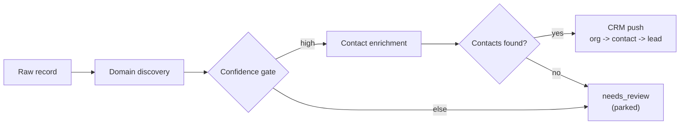
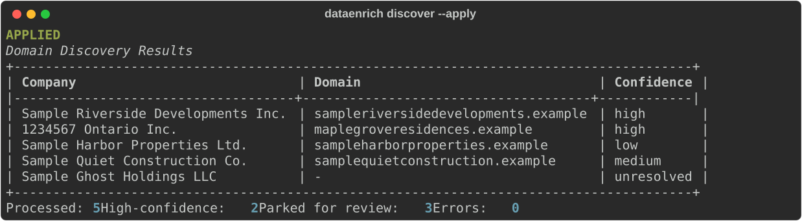
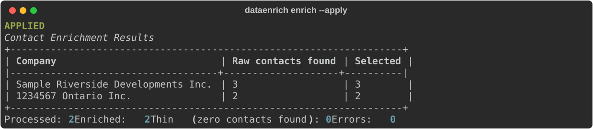
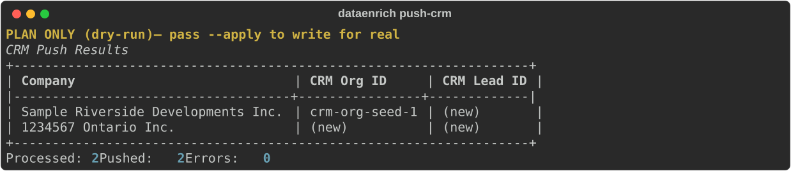
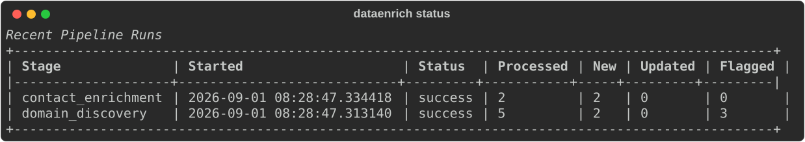

# Data Enrichment System

[](https://github.com/codeapplied/data-enrichment-system/actions/workflows/tests.yml)
[](pyproject.toml)
[](LICENSE)

A company-to-decision-maker contact enrichment pipeline — rebuilt as a generalized,
open-source system.

Originally built as an internal work tool; this repo is a from-scratch rebuild using
generic, sanitized logic only. No employer-specific data, workflows, or branding.

## Status

The originally-scoped pipeline is complete end to end: domain discovery
(confidence-gated), contact enrichment (department-priority ranked), and
CRM push (3-phase find-or-create), all wired into the CLI/DB pipeline, a
CI-tested suite (46 tests — run `pytest`), and a real (not templated)
Pipedrive client alongside network-free sandbox backends for every
external integration point. See
[open issues](https://github.com/codeapplied/data-enrichment-system/issues)
for what's next (a real CSV/Excel import path, reconciliation checks, and
wiring in real search/enrichment vendors in place of their sandboxes).

## Architecture



Every stage logs a `SyncLog` row, which `dataenrich status` reads. Full
breakdown, sequence diagram, module responsibilities, and the reasoning
behind the key design decisions (the confidence gate, field-level
authority, true dry-run safety, department-priority ranking, the
overwrite-protection gate): [docs/ARCHITECTURE.md](docs/ARCHITECTURE.md).

## In action

Real output from the actual CLI (sandbox data, default rules) — not
mockups. Regenerate these with `python scripts/generate_readme_assets.py`
after any CLI change.

**`dataenrich discover --apply`** — resolves 2 of 5 sample organizations at
high confidence, parks the other 3 (one low-confidence single-source match
with an aggregator false-positive correctly excluded, one
agreement-without-confirmation, one fully unresolved):



**`dataenrich enrich --apply`** — ranks and stores contacts for both
domain-resolved organizations:



**`dataenrich push-crm`** (plan-only) — the first organization matches the
sandbox's pre-seeded CRM record and reuses its ID; the second is a genuine
`(new)`, and no CRM write happens either way in dry-run:



**`dataenrich status`** — every stage's `SyncLog` row:



## Domain discovery

`src/dataenrich/discovery/` — confidence-gated: two independent search
signals agreeing *and* a live domain confirmation is "high" (the only tier
that proceeds automatically); numbered/shell-entity company names (e.g.
"1234567 Ontario Inc.") get a project/address-first query instead of a
name-first one. Ships with a network-free sandbox backend by default —
see [ARCHITECTURE.md](docs/ARCHITECTURE.md) for the full module breakdown.

## Contact enrichment

`src/dataenrich/enrichment/` — turns a resolved domain into ranked, stored
contacts, re-sorted by department relevance instead of the vendor's
default seniority-first order (a real, measured fix in the reference
system this project is modeled on).

## CRM push

`src/dataenrich/crm/` — three ordered find-or-create phases (organization
→ contact → lead), each deduplicated (website / email / (org, title)) so
re-running is always safe. A lead is modeled per *project*, not per
company. Includes a real, working Pipedrive client, not just a template.

## Setup

```
uv venv
uv pip install -e .
cp config/.env.example .env
cp config/rules.example.yaml config/rules.yaml
dataenrich init
```

Try it end to end with just the sandbox backends, no credentials needed:

```
dataenrich seed-demo
dataenrich discover --apply
dataenrich enrich --apply
dataenrich push-crm --apply
dataenrich status
```

## CLI

- `dataenrich init` — create the database
- `dataenrich status` — recent pipeline runs
- `dataenrich rules` — show the loaded department-priority and domain-exclusion rules
- `dataenrich seed-demo` — load the bundled sandbox fixture as pending organizations (demo/test data only — there's no CSV/Excel import for your own data yet)
- `dataenrich discover [--apply]` — run domain discovery for pending organizations. Plan-only by default. Only "high" confidence proceeds automatically (status → `domain_resolved`); everything else is parked (`needs_review`) — field-level authority means a later run never touches a non-`pending` organization again, so a human's manual correction always sticks
- `dataenrich enrich [--apply]` — run contact enrichment for domain-resolved organizations. Plan-only by default. Contacts are ranked by department priority and stored (top 5); a domain that resolves but returns zero contacts is parked back to `needs_review` rather than marked "enriched" with nothing in it
- `dataenrich push-crm [--apply]` — push enriched organizations to the CRM: organization → contact → lead, each a find-or-create. Plan-only by default — no CRM writes at all, not even to the sandbox's in-memory fake

## Testing

```
uv pip install -e ".[dev]"
pytest
```

46 tests covering: the confidence gate against all 4 tiers, query
construction (including the numbered-entity anchor selection), exclusion
filtering, department-priority ranking, the overwrite-protection gate, a
real (mocked-HTTP) Pipedrive client, and every pipeline stage end-to-end
against a real temp SQLite DB — including field-level authority (a second
run never reprocesses an already-advanced row) and true dry-run safety
(no `create_*` call ever reaches a client, sandbox or real, in plan-only
mode).

## Adding a real vendor

See [docs/ADDING_A_VENDOR.md](docs/ADDING_A_VENDOR.md).

## License

MIT — see [LICENSE](LICENSE).
