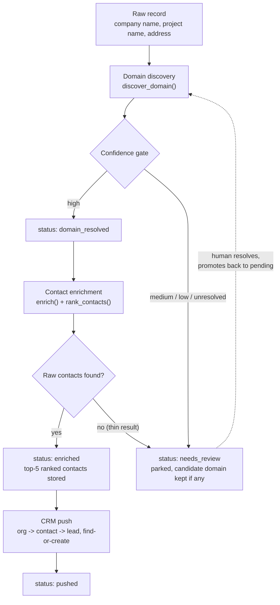
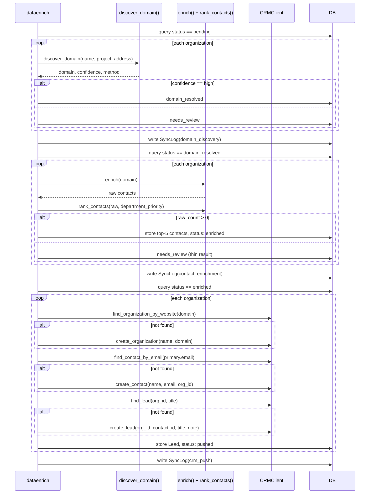
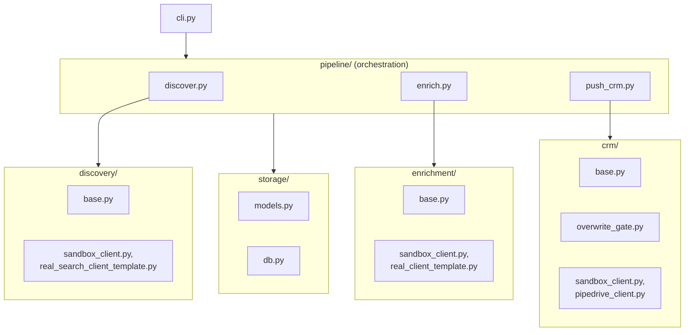

# Architecture

## Data flow

Every pipeline stage writes a `SyncLog` row (`domain_discovery` /
`contact_enrichment` / `crm_push`) — what `dataenrich status` reads.
`needs_review` is a dead end for automation by design: nothing in this
codebase ever re-promotes a parked organization on its own. A human
resolves it (confirms/corrects the domain, or accepts a thin result) and
moves it back to `pending`/`domain_resolved` themselves.

## Sequence: one full pipeline run

## Components

| Module | Responsibility |
|---|---|
| `discovery/query.py` | Builds two deliberately different search-query shapes per company; numbered/shell-entity names get a project/address-first query |
| `discovery/confidence.py` | The confidence gate — resolves votes + head-confirmation into high/medium/low/unresolved |
| `discovery/exclusion.py` | Living domain/keyword blocklist, applied before a result becomes a vote |
| `discovery/base.py` | `SearchClient` interface + `discover_domain()` orchestrator |
| `discovery/sandbox_client.py` | Default demo search backend — bundled fixture data, zero network |
| `discovery/real_search_client_template.py`, `http_head_check.py` | Template for a real search vendor + a real, working HTTP HEAD confirmation check |
| `enrichment/base.py` | `ContactEnrichmentClient` interface + `RawContact`/`EnrichmentResult` types |
| `enrichment/ranking.py` | Re-sorts contacts by department priority instead of the vendor's default seniority-first order |
| `enrichment/sandbox_client.py` | Default demo enrichment backend, including one domain seeded with zero contacts (a "thin" result) |
| `enrichment/real_client_template.py` | Template for a real contact-enrichment vendor |
| `crm/base.py` | `CRMClient` interface — org dedup by website, contact by email, lead by (org, title) |
| `crm/overwrite_gate.py` | Shared "diff live value, auto-approve only safe cases" gate |
| `crm/sandbox_client.py` | Default demo CRM backend, pre-seeded with one existing org (proves dedup against pre-existing data, not just within-run) |
| `crm/pipedrive_client.py` | A real, working Pipedrive REST v1 client (not a template) |
| `pipeline/discover.py` | Orchestrates domain discovery for `pending` organizations |
| `pipeline/enrich.py` | Orchestrates contact enrichment for `domain_resolved` organizations |
| `pipeline/push_crm.py` | Orchestrates the 3-phase CRM push for `enriched` organizations |
| `storage/models.py` | `Organization`, `Contact`, `Lead`, `SyncLog` SQLAlchemy models |
| `storage/db.py` | Engine/session setup (SQLite) |
| `config.py` | `.env` + `rules.yaml` loading |
| `cli.py` | Typer CLI wiring everything above together |

Vendor clients (`*/sandbox_client.py`, `*/pipedrive_client.py`,
`*/real_*_template.py`) contain no DB or business logic — they're thin
backends implementing a shared interface. Orchestration (which rows to
touch, what the confidence/ranking/dedup rules mean for status) lives in
`pipeline/*.py`. This split is what makes the confidence gate, ranking
logic, and dedup rules independently unit-testable without any network
access, and what makes swapping a sandbox backend for a real vendor a
one-line change in `pipeline/*.py`'s `_default_client()`.

## Design decisions

**Confidence is a hard architectural gate, not a score shown to a human.**
Only "high" confidence (two independent search signals agree, and the
domain is live-confirmed) proceeds automatically. Everything else — a
single confirmed signal, agreement without confirmation, total
disagreement — is parked (`needs_review`) rather than pushed downstream
with a caveat. This was the single highest-leverage design decision in the
reference system this project is modeled on: roughly half of all
formally-reviewed flagged bad leads traced to exactly the failure mode this
gate exists to prevent (see the private design notes this rebuild was
informed by — not part of this repo).

**Field-level authority, not blanket automation.** Every pipeline stage
only ever reads organizations at the specific status it's responsible for
(`pending` for discovery, `domain_resolved` for enrichment, `enriched` for
CRM push). An organization already parked or already moved past a stage is
never silently re-processed on a later run — a human (or the next stage)
has to move it forward explicitly. This is enforced by construction (a
`WHERE status == X` query), not by convention.

**Plan-only by default, `--apply` to write for real — and dry-run means
zero external mutation, not just zero DB writes.** `discover`, `enrich`,
and `push-crm` all default to computing and printing what *would* happen.
`push_crm.py` goes further than a simple DB-write skip: in plan-only mode,
no `create_*` method is ever called on the CRM client at all — not even
against the sandbox's in-memory fake — because a naive "skip only the DB
write" dry-run would still silently mutate a stateful client if the same
instance were reused across calls.

**Department-priority re-ranking overrides the vendor's default sort.**
Contact-enrichment vendors typically sort by seniority (C-suite first).
The reference system's own real outcomes showed the actual decision-makers
for this industry sit in development/construction/property-management
functions — the ranking module exists specifically to correct that
mismatch, not to second-guess the vendor's data itself.

**A lead is modeled per project, not per company.** A single developer can
have multiple concurrently active projects, each needing independent
outreach tracking. Since an `Organization` row here already represents one
raw project/prospect record, one `Lead` per `Organization` row already *is*
one lead per project — CRM organization-level dedup (by website) happens
at push time via find-or-create, without needing a separate
company/developer table.

**A shared overwrite-protection gate, not per-call-site judgment.**
`overwrite_gate.decide_write()` is a small pure function every CRM-write
path is meant to funnel through: empty-in-CRM or identical values
auto-write, a real conflict is reported and skipped rather than silently
overwritten. Centralizing this once prevents the class of bug where one
write path's conflict-handling silently drifts from another's.

**Sandbox-first, real vendor as a documented follow-up.** Every external
integration point (search, contact enrichment, CRM) ships with a working,
network-free sandbox backend as the default, plus either a documented
template (`real_search_client_template.py`, `real_client_template.py`) or
a real-but-untested client (`pipedrive_client.py`) for the real thing. This
mirrors the honest-limitation pattern used throughout the sibling
[tender-tracking-system](https://github.com/codeapplied/tender-tracking-system)
repo: verified via mocked-HTTP-shape tests where no live account was
available, never claimed as more than that.

**Naive UTC everywhere, not timezone-aware datetimes.** SQLite doesn't
preserve timezone info across a save/reload — a timezone-aware value read
back from the DB would never equal a freshly-computed one, even when the
underlying instant is identical. `storage/models.py`'s `utcnow()` stays
naive-UTC everywhere, the same fix already validated in the sibling repo
after it hit this as a real bug.

## Adding a new vendor

See [ADDING_A_VENDOR.md](ADDING_A_VENDOR.md) — covers search, contact
enrichment, and CRM extension points.
